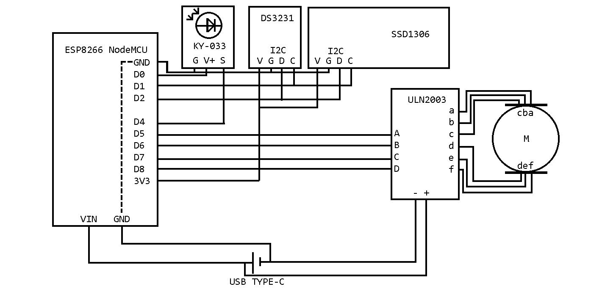
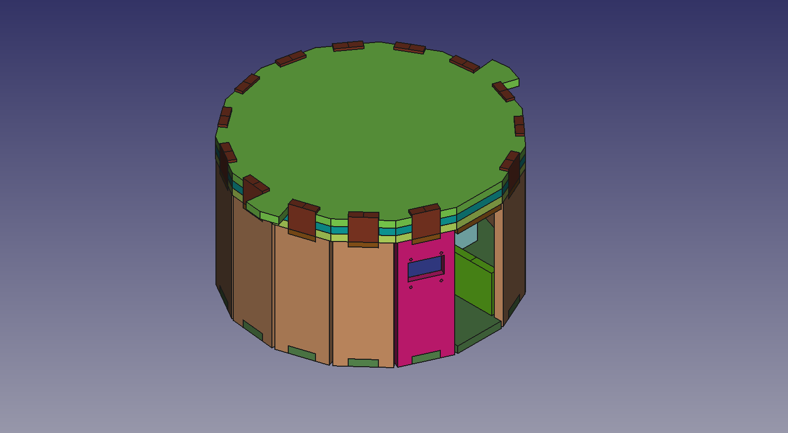

# Репозиторий прошивки продукта индивидуального учебного (школьного) проекта «Автоматизация приема лекарств»
В репозитории представлена схема и прошивка электронной таблетницы (на базе микроконтроллера `ESP8266`).

Автор: Брискиндов Леонид, 2024 год

# Обновление после выпуска
[Индивидуальный учебный проект (PDF-файл)](passport.pdf) 
Сборка таблетницы в среде САПР:

